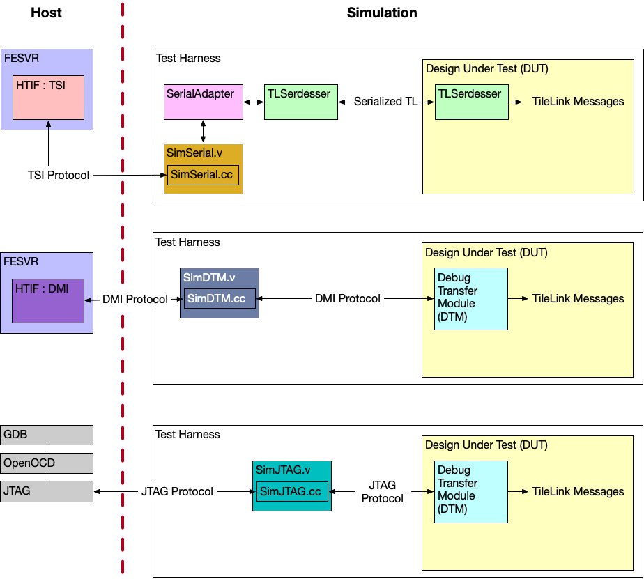

# Lab 2: "151T Forge" Sodor Repository Setup

## Introduction

In lecture sessions, we talked about Chipyard, Rocket Chip, various RISC-V cores, etc.. And in Lab 1, you learned Chisel. We are now going to use Chisel and System Verilog to setup an SoC repository for the 151T tapeout called "151T Forge". 

Forge is going to be a teaching version of the integrated SoC development platform [Chipyard](https://github.com/ucb-bar/chipyard). This is a Spring 2026 experiment driven by feedback to integrate System Verilog usage, remove dependency on Chipyard (which some find quite complex), and integrate IP from scratch. 

Since this is an experiment, you are encouraged to explore your own ideas, provide feedback, submit Github pull requests, and document errors on the Discord. Everybody will work together on the same repository, creating branches and pull requests as described in Lab 0. Do NOT force push to the main branch even if settings do not prevent you from it. 

The [Sodor project](https://github.com/ucb-bar/riscv-sodor) provides multiple pipelined implementations (1-, 2-, 3-, 5-stage, and microcoded) of an integer RISC-V core written in Chisel. You might've seen the Sodor core before in CS152. You can choose any of the 1-5 stage cores to start.

- 1-stage (essentially an ISA simulator)

- 2-stage (demonstrates pipelining in Chisel)

- 3-stage (uses sequential memory; supports both Harvard and Princeton versions)

- 5-stage (can toggle between fully bypassed or fully interlocked)

- "bus"-based micro-coded implementation

As the Lab 2 deliverable, you will run through the repository setup. Then you will run existing assembly (RISC-V) tests on the Sodor core. Your submisison is the core passing all tests. Staff will work in parallel to provide guidance for the follow-up tasks, currently listed as "next steps," but you're welcome to jump ahead. 

Later you will add peripherals, run verification, and take the Sodor RTL through physical-design (PD) flows in Sky130 to tapeout.

## Instructional account access

We will now set up your Forge environment.

**(1) Make sure you know your instructional account login.**

*(These instructions are very similar to [EECS151 Lab 1](https://github.com/EECS150/asic-labs-sp24/tree/main).. Review that lab if you need a refresher on using instructional machines.)*

If you are formally enrolled, you should have a 151T account. Else you may need to generate an instructional account:

1. Visit WebAcct: [http://inst.eecs.berkeley.edu/webacct](http://inst.eecs.berkeley.edu/webacct).
2. Click "Login using your Berkeley CalNet ID"
3. Click on "Get a new account".

Once the account has been created, you can email your class account form to yourself to have a record of your account information. You can follow the instructions on the emailed form to change your Linux password with `ssh update.eecs.berkeley.edu` and following the prompts.

Like EECS151, the servers used for this class are most likely primarily `eda-[1-4].eecs.berkeley.edu`.

You can check which machines are available at: [https://hivemind.eecs.berkeley.edu/](https://hivemind.eecs.berkeley.edu/).

**(2) Login to a lab machine over SSH.**

*(These instructions are very similar to [EECS151 Lab 1](https://github.com/EECS150/asic-labs-sp24/tree/main).. Review that lab if you need a refresher on using instructional machines.)*

Note: If you are off-campus (or off the EECS network), you may need to use the GlobalProtect VPN for these steps.

**SSH is the preferred connection because most work will be performed using the terminal and should be used unless a GUI is required**. The SSH protocol also enables file transfer between your local and lab machines via the `sftp` and `scp` utilities. **WARNING: DO NOT transfer files related to CAD tools to your personal machine. Only transfer files as needed. Even though 151T uses open source content, some of these files are very large.**

How To:

- Linux, BSD, MacOS  
    
    Access your workstation through SSH by running:
    
    ```shell
    ssh USERNAME@eda-X.eecs.berkeley.edu
    ```
    
    In our examples, this would be:
    
    ```shell
    ssh USERNAME@eda-8.eecs.berkeley.edu
    ```
    
- Windows  

    The classic and most lightweight way to use SSH on Windows is PuTTY ([https://www.putty.org/](https://www.putty.org/)). Download it and login with the FQDN above as the Host and your instructional account username. You can also use WinSCP (winscp.net) for file transfer over SSH.
    
    Advanced users may wish to install Windows Subsystem for Linux ([https://docs.microsoft.com/en-us/windows/wsl/install-win10](https://docs.microsoft.com/en-us/windows/wsl/install-win10), Windows 10 build 16215 or later) or Cygwin (cygwin.com) and use SSH, SFTP, and SCP through there.

**(3) Please, please - use tmux!**

It is _**highly**_ recommended to utilize one of the following SSH session management tools: `tmux` or `screen`. This would allow your remote terminal sessions to remain active even if your SSH session disconnects, intentionally or not. Below are tutorials for both:

- [Tmux Tutorial](https://www.hamvocke.com/blog/a-quick-and-easy-guide-to-tmux/)
- [Screen Tutorial](https://www.rackaid.com/blog/linux-screen-tutorial-and-how-to/)

> [!WARNING]
> If you run commands in a "raw" (without `nohup` or `tmux`) SSH terminal, they will be killed when you exit your session (or if your wifi goes out for a few seconds).
> 
> To use [`tmux`](https://tmuxcheatsheet.com/), you can add `RemoteCommand tmux new -A -s ssh` to your ssh config for your instructional account or run `tmux new-s -t <name>` once you log in. (Reference the tutorial above if you're confused.)
> 
> You can also run a command `cmd` as `nohup cmd` to prevent the command from being killed if the session exits, but this is less convenient.
> 
> If you manually created a `tmux` session, you must reattach to it manually the next time you log in with `tmux a -t <name>`.

Whenever you enter an SSH session, you should start or attach to a `tmux` session. 

**(4)** **SSH'ed into an EDA machine, clone and make a branch on our public Forge repo.** 

Go to: [https://github.com/ucb-eecs151tapeout/151t-forge](https://github.com/ucb-eecs151tapeout/151t-forge)

Copy the SSH clone URL. It will look something like: ``git@github.com:ucb-eecs151tapeout/151t-forge.git``

Clone the repository and make a branch:

```
git clone git@github.com:ucb-eecs151tapeout/151t-forge.git
cd 151t-forge
git checkout -b ${USER}-working # create your own branch!
git push --set-upstream origin ${USER}-working
```

Note that Chipyard is large, and we usually don't clone Chipyard locally. Forge is a much smaller repository. However, you may still choose to work in the `/scratch` directory, which will have more space, on a lab machine of your choice. Since `/scratch` is not automatically backed up, you will need to login to the same server each time. Chipyard will generate too much data for it to fit in your home directory. Forge in home folder might or might not work once you run physical design. To make a `/scratch` directory:

```
mkdir -m 0700 -p /scratch/$USER
cd /scratch/$USER
```

**(5)** **Add paths to your shell.** 

The following will source the eecs151t bashrc (locating license and binary paths etc.) on startup moving forward. Only `~/.bash_profile` is `source`d on shell startup on instructional machines by default.
```
echo "source ~/.bashrc" >> ~/.bash_profile
echo "source /home/ff/ee198/ee198-20/.eecs151t.bashrc" >> ~/.bashrc
source ~/.bash_profile
```

## Package management and environment setup

When doing SoC design or any sort of project with complicated, intricate subcomponents, it helps to have a reproducible environment with the toolchain and dependencies installed. In other classes and projects, you might've used Conda or Miniforge. 

- **Conda** is a full-featured, Python-based package and environment manager (large installer, broad features, slower installs; supports multiple channels including Anaconda).
  
- **Miniforge** is a minimal Conda-compatible installer that provides a lightweight Conda runtime and common channels (smaller footprint than full Anaconda; you still use `conda` as the command line interface (CLI)). 
  
- **Pixi** is a Rust-based, system-level package manager that builds on the Conda ecosystem/format for faster, safer, and more reproducible installs and better shell integration while remaining compatible with Conda packages.

We will use Pixi for this project as it works for Linux, MacOS, and Windows, while remaining fast and simple. 

**(1)** **Install Pixi.** 

Install Pixi by following the instructions found in the installation guide: [https://pixi.prefix.dev/latest/installation/](https://pixi.prefix.dev/latest/installation/)

For example, a Linux user on EDA might run: 

```curl -fsSL https://pixi.sh/install.sh | sh```

If the output says "Please restart or source your shell," or "For changes to take effect, close and re-open your current shell," run the following or your shell's equivalent (such as zshell):

```
source ~/.bashrc
```

**(2)** **Setup environment.** 

Then run Pixi to install the environment or packages defined by the repository (installs dependencies listed in the project config from within the 151t-forge directory) with:

```$151t-forge/ pixi install```

Glance at the following for quality of life improvements:

- Documentation on Pixi shell integration and how to enable shell completions (helps with activation, command completion, and nicer interactive use): https://pixi.prefix.dev/latest/advanced/pixi_shell/#shell-completions

**(3)** **Initiate submodules.** 

Initialize all repository submodules with:

```
cd 151t-forge
git submodule update --init --recursive
```

Ensure all submodules (e.g., riscv-sodor, riscv-tests) initialize without errors. 

## Build setup for simulations and assembly tests

This section walks you through building the RISC-V ISA simulator, the front-end server, the RISC‑V test suite, and running the Sodor Verilator simulations and assembly tests. Do these steps from your instructional machine (in a tmux session) after your Pixi environment and repo submodules are initialized. To summarize:

- [Spike](https://github.com/riscv-software-src/riscv-isa-sim) (`riscv-isa-sim`) provides a Golden RISC‑V ISA simulator used as a reference and to run tests. We build a local copy so the FESVR and tools used by Forge point to the repository-local install (and so Spike resolves to the Pixi-managed toolchain path).

- [FESVR](https://chipyard.readthedocs.io/en/latest/Advanced-Concepts/Chip-Communication.html) (front-end server) provides the interface used by many simulators to talk to simulated RISC‑V cores. Forge uses a specific FESVR fork compatible with the Sodor setup.

> FESVR is a C++ library that manages communication between a host machine and a RISC-V DUT. For debugging, it provides a simple API to reset, send messages, and load/run programs on a DUT. It also emulates peripheral devices. It can be incorporated with simulators (VCS, Verilator, FireSim), or used in a bringup sequence for a taped out chip.
> 
> 

- `riscv-tests` is the standard assembly test suite (RV32/RV64). We build and install it into the RISC-V target so the emulator and Spike can run the tests.

- The Verilator-based simulator in `sims/verilator` compiles the Sodor RTL into an emulator, runs the assembled tests, and writes logs and (optionally) waveform VCD files.


### Build Spike ISA Simulator

**(1)**

Enter the `riscv-isa-sim` tree and create a build directory: 

```bash
cd ${forge}/tools/riscv-isa-sim

mkdir build

cd build
```

**(2)**

Configure, build, and install:

```bash
../configure --prefix=$RISCV

make -j32

make -j32 install
```

**(3)**

Verify `spike` resolves to the expected path (the Pixi environment’s riscv-tools binary): 

```bash
which spike # should resolve to ${forge}/.pixi/envs/default/riscv-tools/bin/spike
```

### Install FESVR

For now, Forge uses an older, compatible FESVR fork. 

Clone/build/install our forked FESVR following instructions at: [https://github.com/ucb-eecs151tapeout/riscv-fesvr-sodor](https://github.com/ucb-eecs151tapeout/riscv-fesvr-sodor)

It'll install it over the FESVR installed by `riscv-isa-sim` so the simulator and emulator use the correct FESVR version.

### Build and install RISC-V Tests

**(1)**

Enter the tests tree and ensure submodules are present, then generate autotools files and configure.

```bash
cd ${forge}/tests/riscv-tests

autoconf

./configure --prefix=$RISCV/target
```

**(2)**

Build and install the test suite (for RISC-V 32-bit): 

```bash
make -j32 XLEN=32 # XLEN=32 for rv32 isa tests only

make -j32 install
```

Installed test binaries will be placed under `$RISCV/target`. Now we want to build the Sodor Verilator simulator and run assembly tests.

## Building the simulator

We now compile the Sodor RTL into a cycle-accurate, host-executable simulator (using Verilator) and run the assembled RISC‑V tests against that simulator. This step verifies that the hardware RTL implements the ISA behavior expected by the test-suite and exposes functional bugs early in simulation before any physical-design work. Since we are using known-good cores and tests, everything should pass. However, you can write your own tests, and when you made modifications to the core, rerun everything to verify. The general steps are:

- `make rtl`: Generates and prepares the Verilog from the Chisel/RTL sources and any required scaffolding so Verilator can compile the design.

- `make emulator`: Invokes Verilator to compile the design into a C++/executable emulator and links the host-side test harness. The emulator models the Sodor core(s) and provides a bridge to run RISC‑V binaries.

- `make run-asm-tests`: Runs the assembled test programs (from riscv-tests) on the emulator, compares expected outputs, and writes per-test logs. Passing these tests indicates the core’s functional behavior matches the ISA tests used in this lab.

- `make emulator-debug` / `make run-asm-tests-debug`: Build and run a debug-enabled emulator that produces waveform (VCD/other) output. Waveforms let you inspect signal transitions and trace failures at the RTL level when tests fail

### Running fast assembly tests 

To do functional verification without waveform dump:

```bash
cd ${forge}/sims/verilator

make rtl

make emulator

make run-asm-tests

# output logs in ${forge}/sims/verilator/output

```

**(1)** **Run this now and take a screenshot of the output. Do the tests pass?**

Pass / fail summary and per-test logs are in the output directory. Normally you'd look for differences against expected golden (known correct) outputs to identify functional mismatches. Your output should look like:

 

## Getting waveforms for debugging

To debug with waveforms enabled - which leads to larger builds and slower simulation: 

```bash
cd ${forge}/sims/verilator

make rtl

make emulator-debug

make run-asm-tests-debug

# waveforms in ${forge}/sims/verilator/output

```

Waveforms (such as VCD) let you trace signals (fetch/decode/execute stages, register file updates, memory accesses..) to diagnose which pipeline stage or control signal caused a failure.

**(1)** **Generate a waveform.**

We will look more at waveforms later.

# Known Problems

Please let us know if you run into issues, any steps to debug them, and solutions! 

* sodor uses a custom reset -- by writing to 0x44
   * https://github.com/riscv-software-src/riscv-isa-sim/blob/90a04da3f9235e17ab456b9263080f2dc32e4f1e/fesvr/dtm.cc 
   * this should get updated so that sodor supports resuming execution from `0x7b1` (dpc) [spec compliant] after coming out of debug mode.


* cannot build riscv bmark test in rv32 due to ucb-bar riscv toolchain (feedstock) not supporting multi-lib - https://github.com/ucb-bar/riscv-tools-feedstock/pull/8 and the lack of a rv32 toolchain thats been compiled from source (cs152 has one, but ideally we don't depend on that, and we build from scratch)


* when run it creates a bunch of "rv32_2stage", "rv32_1stage" etc folders in `${forge}/generators/riscv-sodor/rv32_1stage`.. these shouldnt be made, its done somewhere in the makefile

# Next Steps (WIP)

We will release more instructions, but as this is a collaborative effort, we're very transparent about the directions as we define them, and welcome your own tackling of these and other problems! 

Things that need to be done before tapeout:

* jtag TAP to DMI unit - https://chipyard.readthedocs.io/en/stable/Advanced-Concepts/Chip-Communication.html
* replace 3 stage's 1 cycle mem w/ srams
* IO
* bump to chisel 3, java 17 or smth, not java 8 (1.8.0), bump scala version from 2.12 to latest CY version
* whats the modern version of chisel-iotesters? move to that
* figure out the custom reset/custom fesvr (to write to 0x44 to start exec) situation, and whether its even viable to keep that around?? (will we successfully bringup if its like that)

We would like to also establish the foundation: you learn where the RTL comes from (Chisel elaboration), how the pipeline and memory/CSR interfaces are structured, and how to correlate the design with the generated SystemVerilog. Without that familiarity, debugging the RTL, integrating peripherals, and interpreting PD/simulation results would be much harder. Treat this as the “get to know the core" step before verification and tapeout.